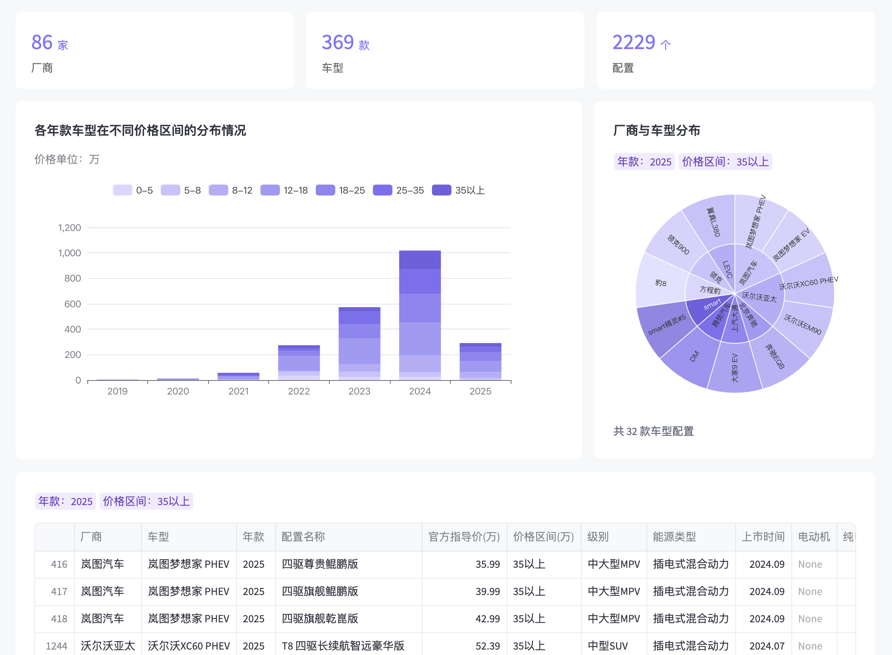
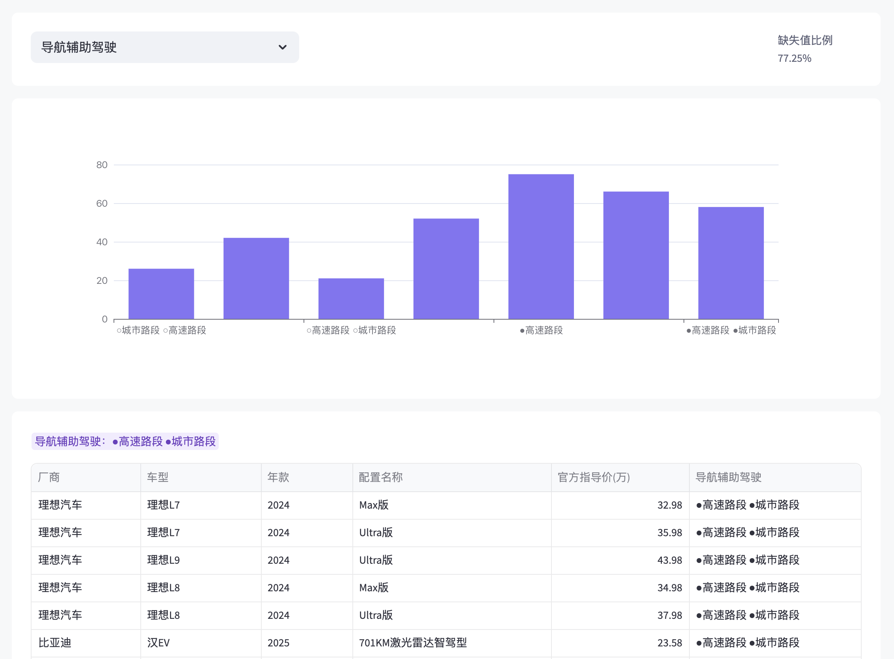
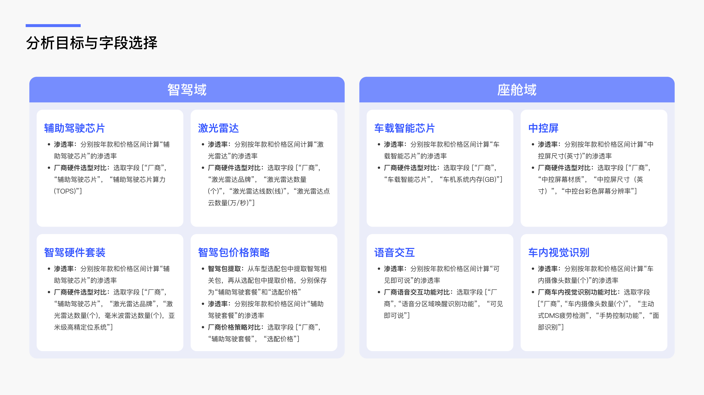

+++
title = '智能车配置趋势分析工具'
slug = 'config_analysis'
info = '通过自动化采集行业竞品车型数据，结合智能分析模型，动态洞察智能配置的发展趋势，助力产品规划和战略决策。'
stack = ["数据采集", "数据分析", "数据可视化"]
date = 2023-10-30T10:59:58+08:00
draft = false
+++

## 背景

智能汽车行业竞争越来越激烈，更新迭代非常快，OEM、Tier1、新势力都在卷配置，比如智驾、激光雷达、中央计算、域控座舱等等。 很多企业在产品规划时，依然依赖有限的人力调研和静态竞品对比，效率太低。

## **目标**

打造一款智能车配置趋势分析工具，通过自动化采集行业竞品车型数据，结合智能分析模型，动态洞察智能配置的发展趋势，助力产品规划和战略决策。

## **过程与方法**

### **数据采集**

从开放平台平台自动化采集车型配置数据，在采集过程中遇到了数据结构复杂、格式异构的挑战，针对这些挑战，我设计了一个可扩展的自动化采集框架，实现高质量结构化数据获取。具体包括：

**1. 多层嵌套表格结构解析**

配置页面存在大量 HTML 嵌套表格，包含车型信息、年款、选配包等多级结构。系统通过深度解析 DOM 节点，动态识别并提取不同层级的配置模块，保证数据采集的完整性。

**2. 异构数据结构自动适配**

面对价格行、车型标签、标准配置项等结构不一致的行数据，设计了标签引导的解析逻辑，自动识别并兼容不同的表格模式，保障了多样化结构统一入库。

**3. 表结构转换与清洗**

原始网页以车型为单位分散展示，不利于数据分析。采集后数据自动规整为一个表格，提升了后续分析的可用性。

**4. 增量采集机制**

支持基于 SeriesID 的断点续采与增量更新机制，避免重复爬取，提高了采集效率并增强了系统的稳定性，便于大规模车型数据的周期性更新与扩展。

### **数据预处理**

**字段提取**

- 利用正则表达式提取车型名称、年款信息和配置项名称，提升数据的结构化程度。
- 针对稀疏字段（如选装包模块）做结构拆解与单独存储，便于后续定向特征提取与分析。

**字段清洗与标准化**

- 移除无效字符（如图标、空白符号等），提升字段内容纯净度。
- 统一关键配置项的命名规范（如芯片名称、远程控制功能等），以提高横向对比的一致性。

**字段数值化处理**

- 将价格字段由字符串格式转换为数值格式，便于后续价格区间划分与分析。

### 数据探索与可视化交互设计

**工具选型**

- **前端框架：Streamlit**
    
    具备 Python 原生支持、轻量部署和组件丰富等优势，能够快速构建交互式数据分析界面。
    
- **可视化组件：st_echarts**
    
    基于 Apache ECharts 封装的 Streamlit 插件，支持高度定制化图表设计，同时提供图表点击事件回传功能，便于通过图表交互行为（如点击条形图中的年款/价格项）驱动后续的表格筛选与展示，实现“图表即筛选器”的探索式数据分析体验。
    

**数据概览**

对数据进行基础统计与可视化分析：

- **基础信息展示：**包括厂商数量，车型数量，配置数量全局指标，展示整体数据规模与覆盖范围。
- **年款及价格分布：**通过堆叠柱形图展示各年款车型在不同价格区间的分布情况，便于观察主力价格段及趋势变化。
- **品牌-车型层级结构：**通过旭日图展示厂商与旗下车型的从属关系，便于观察品牌布局及深度。
- **图表交互联动：** 图表支持点击筛选功能，可直接过滤下方列表数据，快速聚焦感兴趣的品牌、车型或价格区间。

**数据分布**

支持任意字段的数据分布分析与缺失情况可视化：

- 通过字段选择器选定任意字段，展示其值频分布。
- 图表自动计算并标注缺失值比例，辅助识别数据质量问题。
- 柱状图支持点击筛选操作，联动更新数据列表，实现按字段值的快速定位与聚焦。

### **趋势提取与选型对比**

围绕公司重点关注的智能驾驶与智能座舱方向，开展配置项渗透率趋势分析与选型策略比较，形成对智能配置发展路径的结构化认知，辅助产品规划与技术路线制定

**分析主题与字段筛选**

与业务方沟通，确定核心关注点为 配置演进趋势与品牌选型差异**，**据此筛选出相关配置字段，聚焦辅助驾驶、感知硬件、座舱交互等模块。

**数据处理**

- **渗透率计算：**
    
    对每个配置字段，若存在有效值则标记为 1，否则为 0；再按年款或价格区间进行分组，计算均值，得出配置项在该分组下的渗透率水平。
    
- **配置选型对比：**
    
    对目标字段去除缺失值后，组合构建配置路径节点对（如“厂商 → 配置选型”）；进一步统计每一条路径对应的车型数量，并将其作为流宽用于桑基图中，实现配置选型频次的直观表达。
    
- **选配包提取：**
    
    从选装包字段中识别与智能驾驶相关的选配内容（如“智驾”、“Pilot”、“领航”等），构建统一的“辅助驾驶套餐”字段；同时提取其对应的价格信息，标准化为“选配价格”字段。
    

**可视化交互设计**

构建多维度配置渗透率分析的可视化模块，支持图表联动与数据过滤：

- **折线图**：按年款维度展示配置渗透率变化趋势，揭示关键技术的普及路径。
- **柱状图**：按价格区间展示配置渗透率，分析技术方案在不同车型定位中的适配程度。
- **桑基图**：展示厂商与配置选型之间的对应关系，直观对比不同品牌在的配置策略
- **交互联动**：点击折线图或柱状图中的任意项后，实时刷新桑基图数据，实现面向年款、价格区间的配置对比分析。

## DEMO
[demo](demo.mp4)

## 总结

目前已初步构建智能汽车配置分析工具，完成基础数据整理与交互式可视化。后续可从以下几个方向深化洞察能力：

1. **引入销量加权渗透率**：结合实际销量对配置渗透率进行加权，反映市场真实装配水平，提升分析精度与商业价值。
2. **配置组合聚类分析**：基于无监督学习方法对车型配置进行聚类，识别出典型配置模式，如“高阶智驾型”“均衡型”“性价比入门型”等，辅助理解技术方案落地路径与产品定位策略。
3. **配置画像与市场分层**：结合价格区间、年款分布等信息，为每类配置组合构建多维画像，提取核心特征标签，支撑产品规划、竞品对比与市场分层决策。